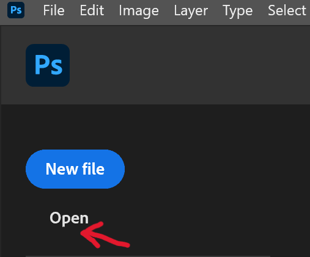
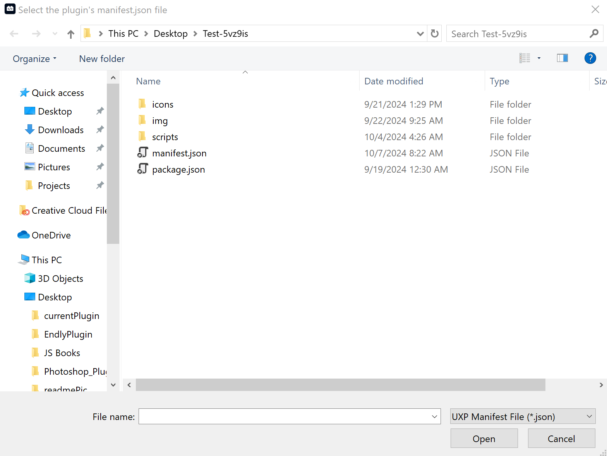
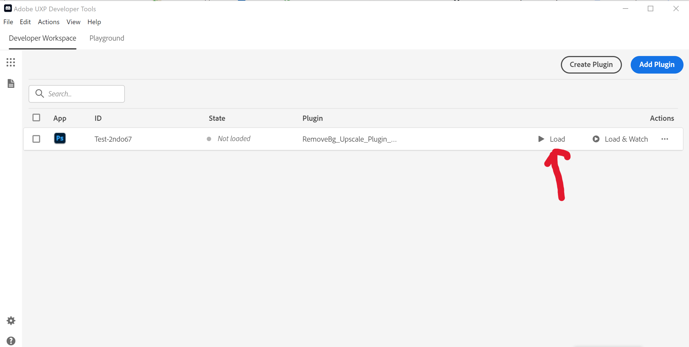

# How to Get Started with Your Photoshop Plugin

Welcome! Follow these easy steps to set up and start using your custom Photoshop plugin.

## Step 1: Install Adobe Photoshop
First things first—get the latest version of Photoshop. Download and install it from the official Adobe website:

[Download Photoshop Free Trial](https://www.adobe.com/products/photoshop/free-trial-download.html)

## Step 2: Install Adobe UXP Developer Tools
To develop and manage plugins, you’ll need the UXP Developer Tools. Install them from Adobe's website:

[Install Adobe UXP](https://developer.adobe.com/photoshop/uxp/2022/guides/devtool/installation)

## Step 3: Launch Photoshop and Add Your Image
Once Photoshop is installed, open the app and add any image you'd like to work with.

- Go to **File > Open** or simply drag and drop your picture into the workspace.

## Step 4: Launch Adobe UXP Developer Tools
Now, open the Adobe UXP Developer Tools application. This is where the magic happens!

## Step 5: Add Your Plugin
In the UXP Developer Tools, follow these steps to add your plugin:

1. Click **Add Plugin**.
2. Navigate to the folder where your plugin files are located.

## Step 6: Select Your Plugin’s Manifest File
When prompted, choose your plugin's `manifest.json` file and click **Open** to load the plugin.

## Step 7: Load the Plugin
Once the manifest is selected, click the **Load Plugin** button in the UXP Developer Tools. Your plugin will now be available in Photoshop.

## Step 8: Use the Plugin
Finally, you’re all set! Go to Photoshop, find your plugin in the **Plugins** menu, and start using it.

🎨 **Enjoy enhancing your creative workflow with your custom plugin!**